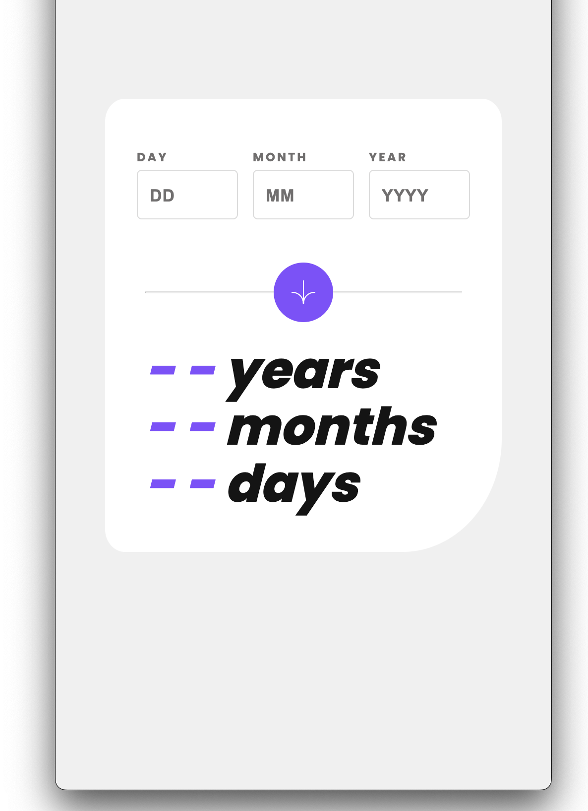
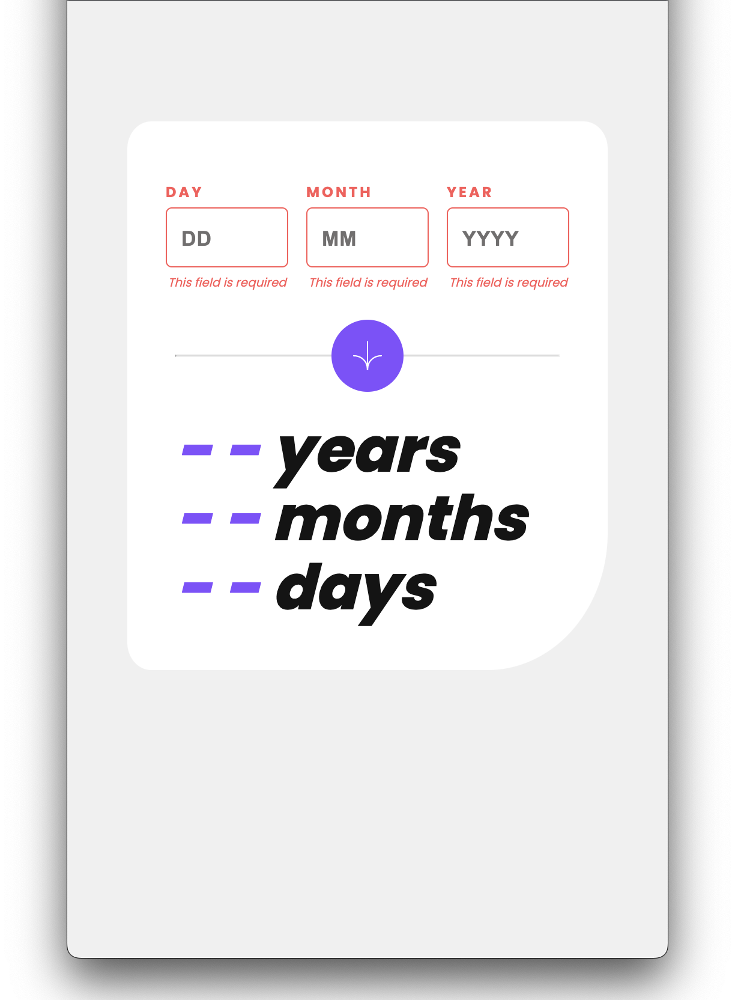
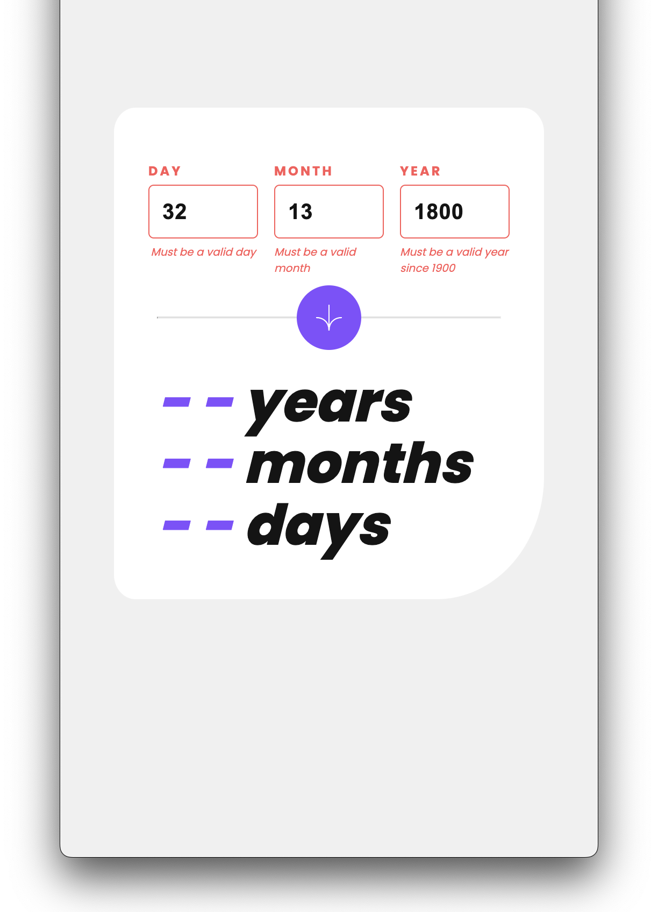
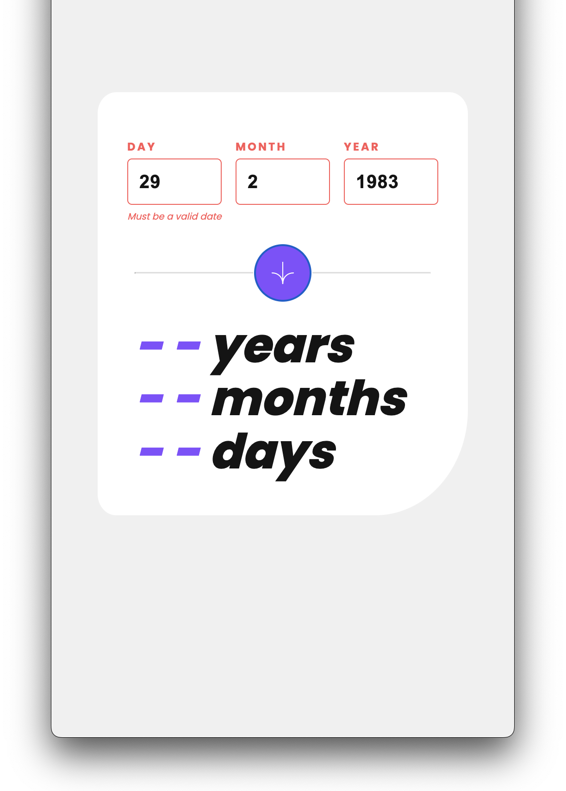
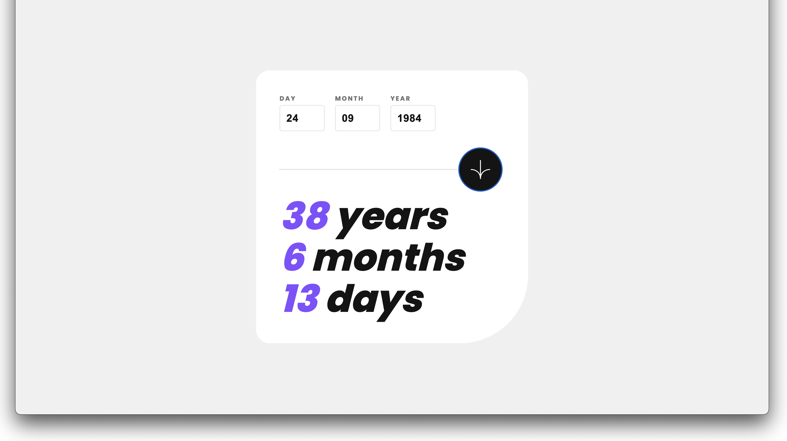

# Frontend Mentor - Age calculator app solution

This is a solution to the [Age calculator app challenge on Frontend Mentor](https://www.frontendmentor.io/challenges/age-calculator-app-dF9DFFpj-Q). Frontend Mentor challenges help you improve your coding skills by building realistic projects.

## Table of contents

- [Overview](#overview)
  - [The challenge](#the-challenge)
  - [Screenshot](#screenshot)
  - [Links](#links)
- [My process](#my-process)
  - [Built with](#built-with)
  - [Continued development](#continued-development)
- [Author](#author)

## Overview

### The challenge

Users should be able to:

- View an age in years, months, and days after submitting a valid date through the form
- Receive validation errors if:
  - Any field is empty when the form is submitted
  - The day number is not between 1-31
  - The month number is not between 1-12
  - The year is in the future
  - The date is invalid e.g. 31/04/1991 (there are 30 days in April)
- View the optimal layout for the interface depending on their device's screen size
- See hover and focus states for all interactive elements on the page
- **Bonus**: See the age numbers animate to their final number when the form is submitted

### Screenshot

<table>
    <tr>
        <td>
            
            
        </td>
    </tr>
    <tr>
        <td>
            
            
        </td>
      </tr>
      <tr>
        <td>
            
        </td>
    </tr>
</table>

### Links

- Solution URL: [here](https://www.frontendmentor.io/solutions/age-calculator-app-using-reactjs-html-and-css-1jcX9QXLEG)
- Live Site URL: [here](https://zun-liang.github.io/age-calculator-app/)

## My process

### Built with

- HTML5
- CSS3
- Flexbox
- Mobile-first workflow
- React.js
- React CountUp

### Continued development

- React hooks
- API

## Author

- Website - [Zun Liang](https://zunldev.com/)
- GitHub - [@zun-liang](https://github.com/zun-liang)
- Frontend Mentor - [@zun-liang](https://www.frontendmentor.io/profile/zun-liang)
- freeCodeCamp - [@zun-liang](https://www.freecodecamp.org/zun-liang)
